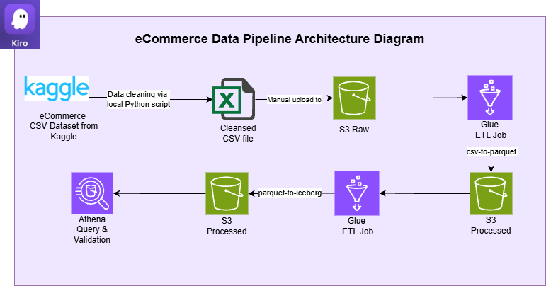
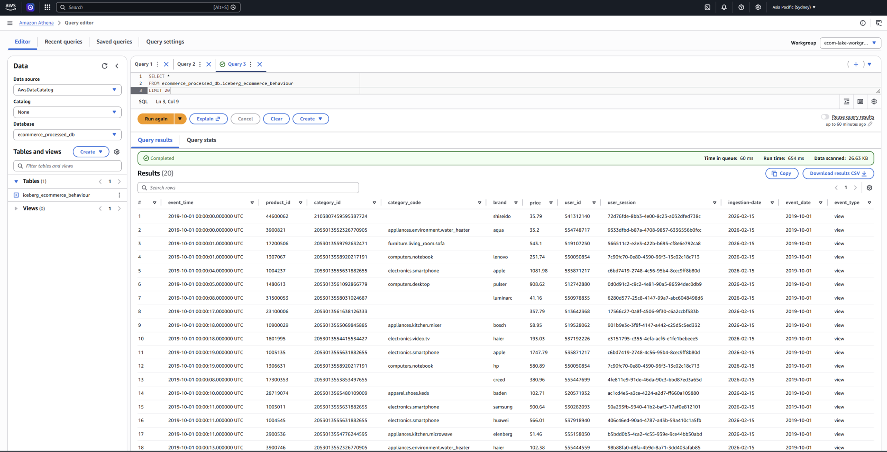

# AWS-eCommerce-data-pipeline
AWS Data Engineering Pipeline for eCommerce dataset from Kaggle (AWS Glue, Iceberg, Athena)

## Overview
The project created a data pipeline leveraging AWS Services including but not limited to AWS Glue, Iceberg and Athena. AWS Kiro was used to accelerate the development, which allowed the project to be completed within two days.

The eCommerce dataset is sourced from Kaggle: https://www.kaggle.com/datasets/mkechinov/ecommerce-behavior-data-from-multi-category-store

**Architecture Diagram**

## How this was built

The eCommerce CSV dataset was retrieved from Kaggle after verifying that the dataset license permitted its intended use.

The dataset was subsequently cleaned and pre-processed using a local Python script named _clean_and_extract.py_. The processed output was then uploaded to an Amazon S3 bucket designated for raw data storage.

Following this, two **AWS Glue jobs** were configured:
1. The first job converted the **CSV file into Parquet format** and stored the output in a separate Amazon S3 bucket designated for processed data. This transformation was implemented using the script _csv-to-parquet.py_.
2. The second job **ingested the Parquet files and loaded them into Apache Iceberg tables** within the same processed S3 bucket. This transformation was implemented using the script _parquet-to-iceberg.py_.

Finally, the contents of the Iceberg tables were validated using queries executed in Amazon Athena to ensure data completeness and consistency.

## Sample of the Athena Query Result

## Future Improvements
- Create QuickSight dashboards to visualise data, and allow for convenient analysis
- Automate validation steps for data quality instead of manual validation i.e. Python code
